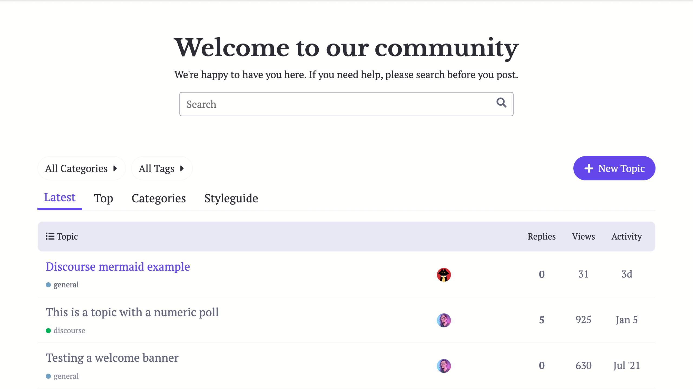
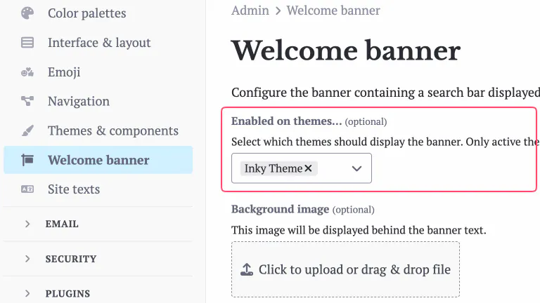
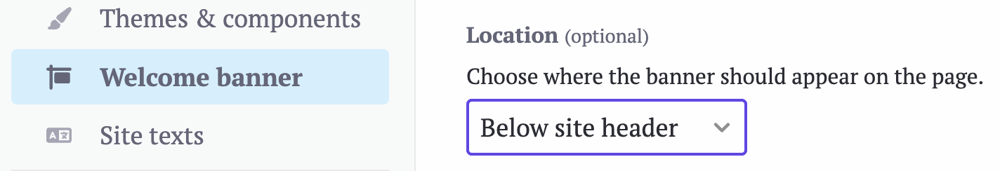

# Inky Theme

The theme is designed to make reading easy. Light and dark modes are available.

## Features

### Light Mode

### Dark Mode

## Theme Configuration

Change the following settings for this theme to render properly.

### Welcome Banner

Go to **Admin > Welcome banner** (`/admin/config/welcome-banner`) page.

- in **Enabled on themes...** dropdown select `Inky Theme`

  

- **Location** should be set to `Below site header`

  

---

Feel free to let me know how this theme could be improved. I hope you enjoy!

|              |                              |                                                                                                                             |
| ------------ | ---------------------------- | --------------------------------------------------------------------------------------------------------------------------- |
| :eyeglasses: | **Preview**                  | [Preview on theme creator](https://theme-creator.discourse.org/theme/ella/inky)                                             |
| :question:   | **Install Guide**            | [How to install a theme or theme component](https://meta.discourse.org/t/how-do-i-install-a-theme-or-theme-component/63682) |
| :open_book:  | **New to Discourse Themes?** | [Beginner’s guide to using Discourse Themes](https://meta.discourse.org/t/beginners-guide-to-using-discourse-themes/91966)  |
